# Skill Dependencies

Arrows point from a skill to each skill it references. References are conservative and do not grant execution authority.

```mermaid
flowchart LR
  subgraph stages
    skill_stages["stages"]
  end
  subgraph playbooks
    skill_authoring_project_verification["authoring-project-verification"]
    skill_authoring_skills["authoring-skills"]
    skill_development_review["development-review"]
    skill_diagnosing_bugs["diagnosing-bugs"]
    skill_ingest_document["ingest-document"]
    skill_integrating_web_apis["integrating-web-apis"]
    skill_prototype["prototype"]
    skill_refactoring["refactoring"]
  end
  subgraph techniques
    skill_alignment["alignment"]
    skill_calling_web_apis["calling-web-apis"]
    skill_commit["commit"]
    skill_diagramming["diagramming"]
    skill_dry_run["dry-run"]
    skill_pause_work["pause-work"]
    skill_project_documentation["project-documentation"]
    skill_propose_first["propose-first"]
    skill_reflect["reflect"]
    skill_repitch["repitch"]
    skill_show_me["show-me"]
    skill_tdd["tdd"]
    skill_understanding_code["understanding-code"]
    skill_verifying_work["verifying-work"]
    skill_writing["writing"]
  end
  subgraph principles
    skill_principle_boundary_discipline["principle-boundary-discipline"]
    skill_principle_build_the_lever["principle-build-the-lever"]
    skill_principle_design_deep_modules["principle-design-deep-modules"]
    skill_principle_encode_lessons_in_structure["principle-encode-lessons-in-structure"]
    skill_principle_exhaust_the_design_space["principle-exhaust-the-design-space"]
    skill_principle_experience_first["principle-experience-first"]
    skill_principle_fix_root_causes["principle-fix-root-causes"]
    skill_principle_foundational_thinking["principle-foundational-thinking"]
    skill_principle_guard_the_context_window["principle-guard-the-context-window"]
    skill_principle_laziness_protocol["principle-laziness-protocol"]
    skill_principle_make_operations_idempotent["principle-make-operations-idempotent"]
    skill_principle_migrate_callers_then_delete_legacy_apis["principle-migrate-callers-then-delete-legacy-apis"]
    skill_principle_minimize_reader_load["principle-minimize-reader-load"]
    skill_principle_model_the_domain["principle-model-the-domain"]
    skill_principle_never_block_on_the_human["principle-never-block-on-the-human"]
    skill_principle_outcome_oriented_execution["principle-outcome-oriented-execution"]
    skill_principle_prove_it_works["principle-prove-it-works"]
    skill_principle_redesign_from_first_principles["principle-redesign-from-first-principles"]
    skill_principle_separate_before_serializing_shared_state["principle-separate-before-serializing-shared-state"]
    skill_principle_sequence_verifiable_units["principle-sequence-verifiable-units"]
    skill_principle_subtract_before_you_add["principle-subtract-before-you-add"]
    skill_principle_type_system_discipline["principle-type-system-discipline"]
    skill_principles["principles"]
  end
  skill_authoring_project_verification --> skill_authoring_skills
  skill_authoring_project_verification --> skill_calling_web_apis
  skill_authoring_project_verification --> skill_verifying_work
  skill_authoring_skills --> skill_project_documentation
  skill_authoring_skills --> skill_reflect
  skill_development_review --> skill_principle_design_deep_modules
  skill_development_review --> skill_principles
  skill_development_review --> skill_project_documentation
  skill_diagnosing_bugs --> skill_tdd
  skill_diagnosing_bugs --> skill_verifying_work
  skill_integrating_web_apis --> skill_calling_web_apis
  skill_integrating_web_apis --> skill_development_review
  skill_integrating_web_apis --> skill_diagnosing_bugs
  skill_integrating_web_apis --> skill_principle_boundary_discipline
  skill_integrating_web_apis --> skill_principle_design_deep_modules
  skill_integrating_web_apis --> skill_project_documentation
  skill_integrating_web_apis --> skill_tdd
  skill_integrating_web_apis --> skill_verifying_work
  skill_principle_build_the_lever --> skill_principle_encode_lessons_in_structure
  skill_principle_build_the_lever --> skill_principle_laziness_protocol
  skill_principle_build_the_lever --> skill_principle_prove_it_works
  skill_principle_minimize_reader_load --> skill_principle_guard_the_context_window
  skill_principle_sequence_verifiable_units --> skill_principle_build_the_lever
  skill_principle_sequence_verifiable_units --> skill_principle_prove_it_works
  skill_principle_type_system_discipline --> skill_principle_boundary_discipline
  skill_principle_type_system_discipline --> skill_principle_encode_lessons_in_structure
  skill_principles --> skill_principle_boundary_discipline
  skill_principles --> skill_principle_build_the_lever
  skill_principles --> skill_principle_design_deep_modules
  skill_principles --> skill_principle_encode_lessons_in_structure
  skill_principles --> skill_principle_exhaust_the_design_space
  skill_principles --> skill_principle_experience_first
  skill_principles --> skill_principle_fix_root_causes
  skill_principles --> skill_principle_foundational_thinking
  skill_principles --> skill_principle_guard_the_context_window
  skill_principles --> skill_principle_laziness_protocol
  skill_principles --> skill_principle_make_operations_idempotent
  skill_principles --> skill_principle_migrate_callers_then_delete_legacy_apis
  skill_principles --> skill_principle_minimize_reader_load
  skill_principles --> skill_principle_model_the_domain
  skill_principles --> skill_principle_never_block_on_the_human
  skill_principles --> skill_principle_outcome_oriented_execution
  skill_principles --> skill_principle_prove_it_works
  skill_principles --> skill_principle_redesign_from_first_principles
  skill_principles --> skill_principle_separate_before_serializing_shared_state
  skill_principles --> skill_principle_sequence_verifiable_units
  skill_principles --> skill_principle_subtract_before_you_add
  skill_principles --> skill_principle_type_system_discipline
  skill_project_documentation --> skill_diagramming
  skill_project_documentation --> skill_understanding_code
  skill_refactoring --> skill_principle_design_deep_modules
  skill_refactoring --> skill_principle_migrate_callers_then_delete_legacy_apis
  skill_refactoring --> skill_principle_minimize_reader_load
  skill_refactoring --> skill_principle_model_the_domain
  skill_refactoring --> skill_principle_subtract_before_you_add
  skill_refactoring --> skill_verifying_work
  skill_reflect --> skill_principle_encode_lessons_in_structure
  skill_reflect --> skill_project_documentation
  skill_reflect --> skill_writing
  skill_stages --> skill_development_review
  skill_stages --> skill_principle_design_deep_modules
  skill_stages --> skill_project_documentation
  skill_stages --> skill_refactoring
  skill_stages --> skill_verifying_work
  skill_tdd --> skill_verifying_work
  skill_understanding_code --> skill_diagramming
  skill_understanding_code --> skill_verifying_work
  skill_verifying_work --> skill_calling_web_apis
  skill_verifying_work --> skill_principle_design_deep_modules
  skill_verifying_work --> skill_principle_prove_it_works
  skill_writing --> skill_diagramming
  skill_writing --> skill_project_documentation
```

Legend: `A --> B` means A directly references B. Nodes are grouped by source role.

## Direct dependencies

| Skill | Role | Direct dependencies and evidence |
| --- | --- | --- |
| `alignment` | techniques | — |
| `authoring-project-verification` | playbooks | `authoring-skills` ([playbooks/authoring-project-verification/SKILL.md:8](<playbooks/authoring-project-verification/SKILL.md?plain=1#L8>)); `calling-web-apis` ([playbooks/authoring-project-verification/references/project-protocol.md:22](<playbooks/authoring-project-verification/references/project-protocol.md?plain=1#L22>)); `verifying-work` ([playbooks/authoring-project-verification/SKILL.md:8](<playbooks/authoring-project-verification/SKILL.md?plain=1#L8>), [playbooks/authoring-project-verification/SKILL.md:22](<playbooks/authoring-project-verification/SKILL.md?plain=1#L22>), [playbooks/authoring-project-verification/references/project-protocol.md:26](<playbooks/authoring-project-verification/references/project-protocol.md?plain=1#L26>)) |
| `authoring-skills` | playbooks | `project-documentation` ([playbooks/authoring-skills/SKILL.md:24](<playbooks/authoring-skills/SKILL.md?plain=1#L24>)); `reflect` ([playbooks/authoring-skills/SKILL.md:75](<playbooks/authoring-skills/SKILL.md?plain=1#L75>)) |
| `calling-web-apis` | techniques | — |
| `commit` | techniques | — |
| `development-review` | playbooks | `principle-design-deep-modules` ([playbooks/development-review/references/architecture.md:3](<playbooks/development-review/references/architecture.md?plain=1#L3>), [playbooks/development-review/references/plan.md:3](<playbooks/development-review/references/plan.md?plain=1#L3>)); `principles` ([playbooks/development-review/references/architecture.md:3](<playbooks/development-review/references/architecture.md?plain=1#L3>), [playbooks/development-review/references/plan.md:3](<playbooks/development-review/references/plan.md?plain=1#L3>)); `project-documentation` ([playbooks/development-review/references/domain.md:3](<playbooks/development-review/references/domain.md?plain=1#L3>), [playbooks/development-review/references/governance.md:3](<playbooks/development-review/references/governance.md?plain=1#L3>), [playbooks/development-review/references/plan.md:3](<playbooks/development-review/references/plan.md?plain=1#L3>), [playbooks/development-review/references/specification.md:3](<playbooks/development-review/references/specification.md?plain=1#L3>)) |
| `diagnosing-bugs` | playbooks | `tdd` ([playbooks/diagnosing-bugs/SKILL.md:34](<playbooks/diagnosing-bugs/SKILL.md?plain=1#L34>), [playbooks/diagnosing-bugs/SKILL.md:129](<playbooks/diagnosing-bugs/SKILL.md?plain=1#L129>)); `verifying-work` ([playbooks/diagnosing-bugs/SKILL.md:34](<playbooks/diagnosing-bugs/SKILL.md?plain=1#L34>)) |
| `diagramming` | techniques | — |
| `dry-run` | techniques | — |
| `ingest-document` | playbooks | — |
| `integrating-web-apis` | playbooks | `calling-web-apis` ([playbooks/integrating-web-apis/SKILL.md:36](<playbooks/integrating-web-apis/SKILL.md?plain=1#L36>)); `development-review` ([playbooks/integrating-web-apis/SKILL.md:10](<playbooks/integrating-web-apis/SKILL.md?plain=1#L10>)); `diagnosing-bugs` ([playbooks/integrating-web-apis/SKILL.md:10](<playbooks/integrating-web-apis/SKILL.md?plain=1#L10>)); `principle-boundary-discipline` ([playbooks/integrating-web-apis/SKILL.md:26](<playbooks/integrating-web-apis/SKILL.md?plain=1#L26>)); `principle-design-deep-modules` ([playbooks/integrating-web-apis/SKILL.md:26](<playbooks/integrating-web-apis/SKILL.md?plain=1#L26>)); `project-documentation` ([playbooks/integrating-web-apis/SKILL.md:38](<playbooks/integrating-web-apis/SKILL.md?plain=1#L38>)); `tdd` ([playbooks/integrating-web-apis/SKILL.md:34](<playbooks/integrating-web-apis/SKILL.md?plain=1#L34>)); `verifying-work` ([playbooks/integrating-web-apis/SKILL.md:34](<playbooks/integrating-web-apis/SKILL.md?plain=1#L34>)) |
| `pause-work` | techniques | — |
| `principle-boundary-discipline` | principles | — |
| `principle-build-the-lever` | principles | `principle-encode-lessons-in-structure` ([principles/principle-build-the-lever/SKILL.md:24](<principles/principle-build-the-lever/SKILL.md?plain=1#L24>)); `principle-laziness-protocol` ([principles/principle-build-the-lever/SKILL.md:22](<principles/principle-build-the-lever/SKILL.md?plain=1#L22>)); `principle-prove-it-works` ([principles/principle-build-the-lever/SKILL.md:24](<principles/principle-build-the-lever/SKILL.md?plain=1#L24>)) |
| `principle-design-deep-modules` | principles | — |
| `principle-encode-lessons-in-structure` | principles | — |
| `principle-exhaust-the-design-space` | principles | — |
| `principle-experience-first` | principles | — |
| `principle-fix-root-causes` | principles | — |
| `principle-foundational-thinking` | principles | — |
| `principle-guard-the-context-window` | principles | — |
| `principle-laziness-protocol` | principles | — |
| `principle-make-operations-idempotent` | principles | — |
| `principle-migrate-callers-then-delete-legacy-apis` | principles | — |
| `principle-minimize-reader-load` | principles | `principle-guard-the-context-window` ([principles/principle-minimize-reader-load/SKILL.md:13](<principles/principle-minimize-reader-load/SKILL.md?plain=1#L13>)) |
| `principle-model-the-domain` | principles | — |
| `principle-never-block-on-the-human` | principles | — |
| `principle-outcome-oriented-execution` | principles | — |
| `principle-prove-it-works` | principles | — |
| `principle-redesign-from-first-principles` | principles | — |
| `principle-separate-before-serializing-shared-state` | principles | — |
| `principle-sequence-verifiable-units` | principles | `principle-build-the-lever` ([principles/principle-sequence-verifiable-units/SKILL.md:18](<principles/principle-sequence-verifiable-units/SKILL.md?plain=1#L18>)); `principle-prove-it-works` ([principles/principle-sequence-verifiable-units/SKILL.md:18](<principles/principle-sequence-verifiable-units/SKILL.md?plain=1#L18>)) |
| `principle-subtract-before-you-add` | principles | — |
| `principle-type-system-discipline` | principles | `principle-boundary-discipline` ([principles/principle-type-system-discipline/SKILL.md:18](<principles/principle-type-system-discipline/SKILL.md?plain=1#L18>)); `principle-encode-lessons-in-structure` ([principles/principle-type-system-discipline/SKILL.md:21](<principles/principle-type-system-discipline/SKILL.md?plain=1#L21>)) |
| `principles` | principles | `principle-boundary-discipline` ([principles/principles/SKILL.md:30](<principles/principles/SKILL.md?plain=1#L30>)); `principle-build-the-lever` ([principles/principles/SKILL.md:24](<principles/principles/SKILL.md?plain=1#L24>)); `principle-design-deep-modules` ([principles/principles/SKILL.md:28](<principles/principles/SKILL.md?plain=1#L28>)); `principle-encode-lessons-in-structure` ([principles/principles/SKILL.md:49](<principles/principles/SKILL.md?plain=1#L49>)); `principle-exhaust-the-design-space` ([principles/principles/SKILL.md:23](<principles/principles/SKILL.md?plain=1#L23>)); `principle-experience-first` ([principles/principles/SKILL.md:22](<principles/principles/SKILL.md?plain=1#L22>)); `principle-fix-root-causes` ([principles/principles/SKILL.md:39](<principles/principles/SKILL.md?plain=1#L39>)); `principle-foundational-thinking` ([principles/principles/SKILL.md:17](<principles/principles/SKILL.md?plain=1#L17>)); `principle-guard-the-context-window` ([principles/principles/SKILL.md:44](<principles/principles/SKILL.md?plain=1#L44>)); `principle-laziness-protocol` ([principles/principles/SKILL.md:16](<principles/principles/SKILL.md?plain=1#L16>)); `principle-make-operations-idempotent` ([principles/principles/SKILL.md:32](<principles/principles/SKILL.md?plain=1#L32>)); `principle-migrate-callers-then-delete-legacy-apis` ([principles/principles/SKILL.md:33](<principles/principles/SKILL.md?plain=1#L33>)); `principle-minimize-reader-load` ([principles/principles/SKILL.md:20](<principles/principles/SKILL.md?plain=1#L20>)); `principle-model-the-domain` ([principles/principles/SKILL.md:29](<principles/principles/SKILL.md?plain=1#L29>)); `principle-never-block-on-the-human` ([principles/principles/SKILL.md:45](<principles/principles/SKILL.md?plain=1#L45>)); `principle-outcome-oriented-execution` ([principles/principles/SKILL.md:21](<principles/principles/SKILL.md?plain=1#L21>)); `principle-prove-it-works` ([principles/principles/SKILL.md:38](<principles/principles/SKILL.md?plain=1#L38>)); `principle-redesign-from-first-principles` ([principles/principles/SKILL.md:18](<principles/principles/SKILL.md?plain=1#L18>)); `principle-separate-before-serializing-shared-state` ([principles/principles/SKILL.md:34](<principles/principles/SKILL.md?plain=1#L34>)); `principle-sequence-verifiable-units` ([principles/principles/SKILL.md:40](<principles/principles/SKILL.md?plain=1#L40>)); `principle-subtract-before-you-add` ([principles/principles/SKILL.md:19](<principles/principles/SKILL.md?plain=1#L19>)); `principle-type-system-discipline` ([principles/principles/SKILL.md:31](<principles/principles/SKILL.md?plain=1#L31>)) |
| `project-documentation` | techniques | `diagramming` ([techniques/project-documentation/SKILL.md:18](<techniques/project-documentation/SKILL.md?plain=1#L18>)); `understanding-code` ([techniques/project-documentation/BOOTSTRAP.md:5](<techniques/project-documentation/BOOTSTRAP.md?plain=1#L5>)) |
| `propose-first` | techniques | — |
| `prototype` | playbooks | — |
| `refactoring` | playbooks | `principle-design-deep-modules` ([playbooks/refactoring/SKILL.md:14](<playbooks/refactoring/SKILL.md?plain=1#L14>)); `principle-migrate-callers-then-delete-legacy-apis` ([playbooks/refactoring/SKILL.md:28](<playbooks/refactoring/SKILL.md?plain=1#L28>)); `principle-minimize-reader-load` ([playbooks/refactoring/SKILL.md:14](<playbooks/refactoring/SKILL.md?plain=1#L14>)); `principle-model-the-domain` ([playbooks/refactoring/SKILL.md:14](<playbooks/refactoring/SKILL.md?plain=1#L14>)); `principle-subtract-before-you-add` ([playbooks/refactoring/SKILL.md:14](<playbooks/refactoring/SKILL.md?plain=1#L14>)); `verifying-work` ([playbooks/refactoring/SKILL.md:18](<playbooks/refactoring/SKILL.md?plain=1#L18>), [playbooks/refactoring/SKILL.md:20](<playbooks/refactoring/SKILL.md?plain=1#L20>), [playbooks/refactoring/SKILL.md:34](<playbooks/refactoring/SKILL.md?plain=1#L34>), [playbooks/refactoring/references/behavior-preservation.md:28](<playbooks/refactoring/references/behavior-preservation.md?plain=1#L28>)) |
| `reflect` | techniques | `principle-encode-lessons-in-structure` ([techniques/reflect/SKILL.md:23](<techniques/reflect/SKILL.md?plain=1#L23>)); `project-documentation` ([techniques/reflect/SKILL.md:25](<techniques/reflect/SKILL.md?plain=1#L25>)); `writing` ([techniques/reflect/SKILL.md:25](<techniques/reflect/SKILL.md?plain=1#L25>)) |
| `repitch` | techniques | — |
| `show-me` | techniques | — |
| `stages` | stages | `development-review` ([stages/stages/references/implement.md:13](<stages/stages/references/implement.md?plain=1#L13>)); `principle-design-deep-modules` ([stages/stages/references/plan.md:7](<stages/stages/references/plan.md?plain=1#L7>)); `project-documentation` ([stages/stages/SKILL.md:29](<stages/stages/SKILL.md?plain=1#L29>), [stages/stages/references/constitute.md:7](<stages/stages/references/constitute.md?plain=1#L7>), [stages/stages/references/implement.md:11](<stages/stages/references/implement.md?plain=1#L11>), [stages/stages/references/plan.md:7](<stages/stages/references/plan.md?plain=1#L7>), [stages/stages/references/specify.md:5](<stages/stages/references/specify.md?plain=1#L5>)); `refactoring` ([stages/stages/references/implement.md:7](<stages/stages/references/implement.md?plain=1#L7>)); `verifying-work` ([stages/stages/references/implement.md:9](<stages/stages/references/implement.md?plain=1#L9>)) |
| `tdd` | techniques | `verifying-work` ([techniques/tdd/SKILL.md:8](<techniques/tdd/SKILL.md?plain=1#L8>)) |
| `understanding-code` | techniques | `diagramming` ([techniques/understanding-code/SKILL.md:21](<techniques/understanding-code/SKILL.md?plain=1#L21>)); `verifying-work` ([techniques/understanding-code/SKILL.md:16](<techniques/understanding-code/SKILL.md?plain=1#L16>)) |
| `verifying-work` | techniques | `calling-web-apis` ([techniques/verifying-work/SKILL.md:21](<techniques/verifying-work/SKILL.md?plain=1#L21>)); `principle-design-deep-modules` ([techniques/verifying-work/references/automated-tests.md:11](<techniques/verifying-work/references/automated-tests.md?plain=1#L11>)); `principle-prove-it-works` ([techniques/verifying-work/SKILL.md:8](<techniques/verifying-work/SKILL.md?plain=1#L8>)) |
| `writing` | techniques | `diagramming` ([techniques/writing/SKILL.md:20](<techniques/writing/SKILL.md?plain=1#L20>)); `project-documentation` ([techniques/writing/SKILL.md:8](<techniques/writing/SKILL.md?plain=1#L8>)) |

## JSON interface

`dependencies.json` has schema version 1. `nodes` is sorted by name and contains each skill's `name`, `role`, repository-relative main `path`, Markdown `resources`, and sorted direct `dependencies`. `edges` has one item per direct pair; each item's `evidence` records a repository-relative `source` and inclusive Markdown block `line_range` (paragraph/block line range, not token offsets). Consumers can traverse outgoing edges for subsets and incoming edges for potential impact. `resources` lists Markdown scan inputs, not a complete installation manifest. Map other resources, including scripts and assets, to the directory containing their owning node's main `path`.
